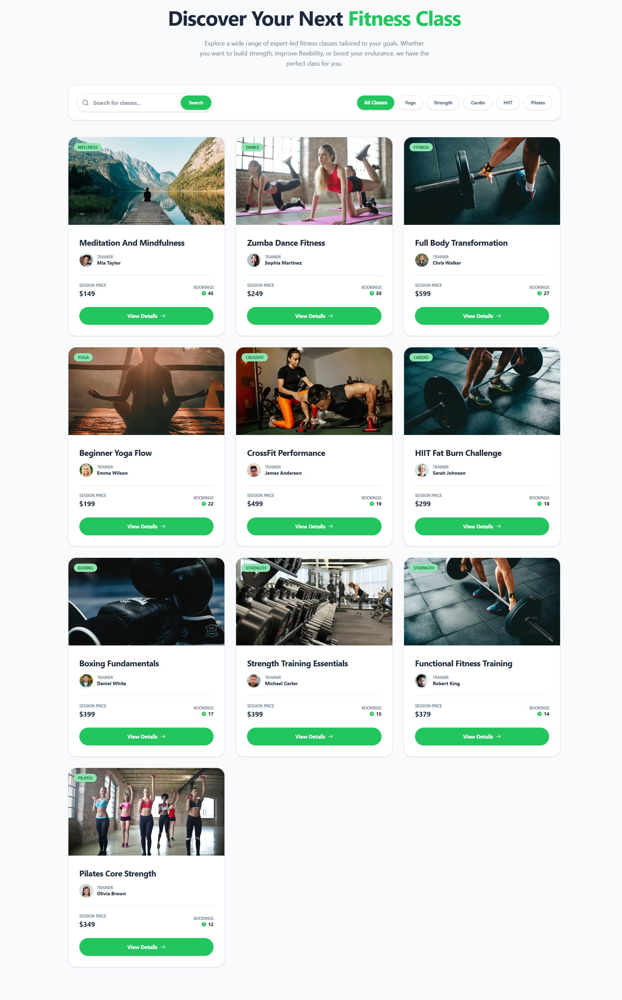
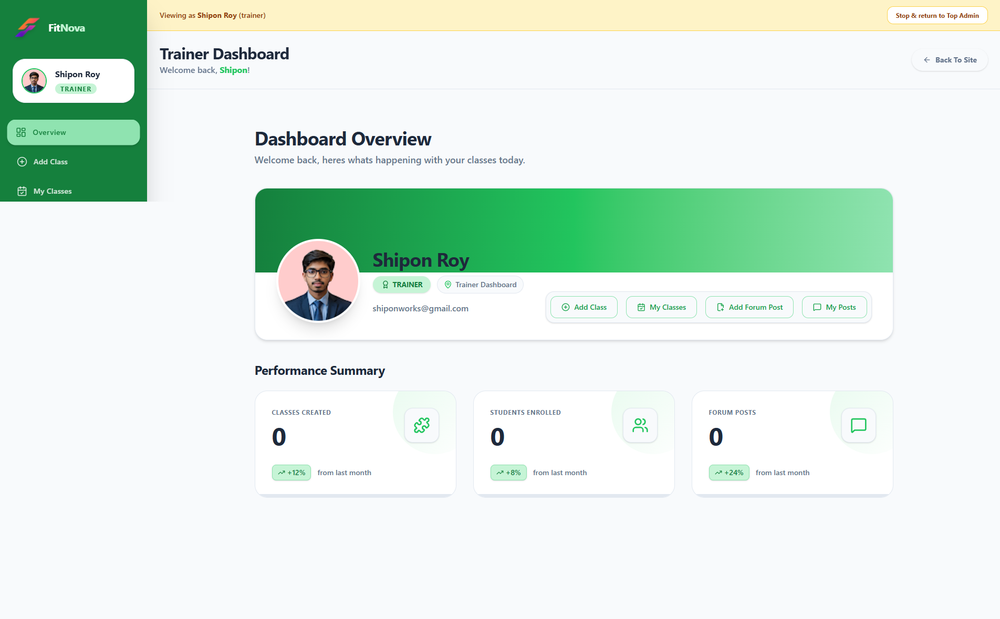
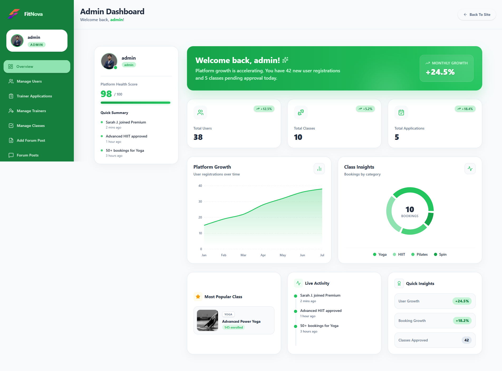

# FitNovaX - Premium Fitness & Learning Platform

A comprehensive, full-stack fitness and learning platform that bridges the gap between expert trainers and fitness enthusiasts. FitNovaX solves the problem of finding, booking, and managing fitness classes by providing a centralized hub where individuals can seamlessly discover classes, participate in a thriving community, and subscribe to premium content. The platform is designed for fitness enthusiasts looking for guided sessions and professional trainers seeking a digital space to host and monetize their expertise.

## Live Links
* **Frontend Application:** [https://fitnovax.vercel.app/](https://fitnovax.vercel.app/)
* **Backend Server:** [https://fitnovax-server.vercel.app/](https://fitnovax-server.vercel.app/)

## Screenshots


*Home Page Showcase*


*All Classes Interface*


*User Dashboard*


*Trainer Dashboard*


*Admin Dashboard*

## Admin Credentials
**Email:** `admin@gmail.com` <!-- Replace with actual admin credentials -->
**Password:** `Admin123` <!-- Replace with actual admin password -->

## Key Features

### Authentication & Security
* Secure registration, login, and logout functionalities utilizing email or Google authentication.
* Comprehensive profile management and strict privacy controls.

### Member Experience
* Browse a wide variety of fitness classes and access detailed course information.
* Save favorite classes for quick reference and personal tracking.
* Seamlessly book fitness classes with just a few clicks.
* Access a personalized dashboard to monitor all active class enrollments.
* Submit detailed applications to transition into an official platform trainer.

### Instructor Capabilities
* Effortlessly create, publish, and manage new fitness programs.
* Track class enrollments, maximum capacities, and overall booking statistics.
* Launch community forum posts to engage directly with students and followers.

### Administrative Control
* Oversee and manage all registered accounts across the platform.
* Review, approve, or reject incoming trainer applications efficiently.
* Maintain oversight of active trainers and their respective permissions.
* Monitor all financial transactions, payments, and class subscriptions.
* Regulate all classes across the platform to ensure high quality standards.
* Moderate community forum posts to foster a safe and welcoming environment.

### Payment & Subscriptions
* Process seamless, secure payments for class subscriptions via an integrated checkout experience.
* Instant unlocking of class bookings immediately upon successful payment confirmation.

### Community Engagement
* Actively participate in dynamic community forum discussions.
* Interact with insightful posts created by trainers and fellow fitness enthusiasts.
* Upvote or downvote forum topics to highlight the most valuable content.
* Join the conversation by leaving comments and participating in threaded replies.

### Intelligent Dashboards
* Dedicated, role-specific interfaces (Admin, Trainer, Member) tailored to distinct operational needs.
* Intuitive navigation designed to effortlessly manage classes, favorites, applications, and community activities.

## Project Structure
```text
ASSESSMENT-PH-A10/
│
├── backend/                   # Express.js Backend Application
│   ├── index.js               # Main Application Entry Point & API
│
└── fontrend/                  # Next.js Frontend Application
    ├── next.config.mjs        # Next.js Configuration
    ├── package.json           # Frontend Dependencies
    └── src/
        ├── app/               # Next.js App Router (Pages & Layouts)
        │   ├── (dashboard)/   # Role-based Dashboards (Admin, Trainer, Member)
        │   ├── (main)/        # Public Pages (Classes, Forum, Profile, Auth)
        │   ├── api/           # Frontend API & Next Auth Configuration
        │   └── globals.css    # Global Styling
        ├── Components/        # Reusable React UI Components
        ├── Hooks/             # Custom React Hooks
        ├── lib/               # Utility Functions and Library Configurations
        └── Shared/            # Shared layouts, headers, and footers
```

## Technology Stack

| Category | Technology |
| :--- | :--- |
| **Frontend Framework** | Next.js, React |
| **Backend Framework** | Node.js, Express |
| **Database** | MongoDB |
| **Authentication** | better-auth (with mongo-adapter), Google OAuth |
| **Payment Gateway** | Stripe |
| **Styling** | Tailwind CSS |
| **UI Components** | HeroUI (`@heroui/react`), Lucide React, React Icons |
| **Animations & Charts** | Framer Motion, Recharts, React CountUp |

## Database Collections

* **`user`**: Manages personal profiles, role assignments, and secure authentication details.
* **`trainerAddClass`**: Stores the details of all fitness classes offered, including descriptions, categories, booking capacities, and approval status.
* **`forumCollection`**: Stores community-driven forum posts, including voting metrics and comment statistics.
* **`applyTrainer`**: Manages the application workflow for members requesting to become platform trainers.
* **`favorites-collection`**: Maintains personalized lists of saved fitness classes.
* **`subscription`**: Records payment transactions, Stripe session details, and class bookings.
* **`commentCollection`**: Facilitates the community forum by storing comments and nested replies linked to specific posts.

## API Overview

| Endpoint Purpose | Access Level | Main Functionality |
| :--- | :--- | :--- |
| `/api/public/all-class` | Public | Fetches all approved classes with optional search and category filters. |
| `/api/public/class-limit` | Public | Fetches top trending/booked classes to highlight on the home page. |
| `/api/user/booked-classes/:userId` | Authenticated | Retrieves all active class bookings for a specific profile. |
| `/subscription` | Public / Auth | Processes Stripe payments and securely records the class subscription. |
| `/api/favorites` | Authenticated | Allows saving or removing classes from personalized favorites lists. |
| `/api/community/forum` | Public | Retrieves a paginated list of community forum discussions. |
| `/api/forum/vote/:id` | Authenticated | Records and manages likes and dislikes on forum posts. |
| `/api/forum/comment` | Authenticated | Enables adding comments or threaded replies to forum discussions. |
| `/api/admin/users/booking-counts`| Admin | Retrieves system-wide, aggregated booking analytics for administrative monitoring. |

## Security Features

* **Authentication Validation**: Robust authentication flow managed securely via `better-auth`.
* **Token Verification**: Uses JSON Web Key Sets (JWKS) and custom `verifyToken` middleware to validate requests against authorized sessions.
* **Role-Based Protection**: Specific middleware (`adminVerify`, `trainerVerify`, `userVerify`) strictly limits backend route access based on assigned roles.
* **Route Protection**: The Next.js frontend implements robust route guards preventing unauthorized access to sensitive dashboards.
* **Payment Integrity**: Validates checkout sessions before finalizing database class booking modifications to prevent fraudulent access.
* **Data Consistency**: Ensures necessary query parameters and relationships are present before mutating database collections.

## Project Highlights

* **Built a scalable full-stack learning platform** capable of serving members, trainers, and administrators with tailored experiences.
* **Implemented secure authentication and role-based access control** across the entire stack, ensuring data privacy and correct permission hierarchies.
* **Developed real-time community engagement features**, including threaded forum comments, post voting, and interactive discussions.
* **Integrated seamless payment and subscription management** using Stripe, providing a frictionless checkout process for class bookings.
* **Designed responsive and accessible user interfaces** utilizing modern aesthetic libraries like Tailwind CSS, HeroUI, and Framer Motion for premium micro-interactions.

## Challenges Solved

* **Complex Aggregation for Dashboard Analytics:** Solved performance bottlenecks by implementing efficient MongoDB aggregation pipelines that calculate system-wide booking counts and transform them into optimized data structures for the admin dashboard.
* **Threaded Nested Comments Architecture:** Engineered a recursive parent-child relationship schema within MongoDB to support infinite threaded replies on community forum posts, while ensuring parent post statistics remain synchronized.
* **Concurrency in Class Bookings:** Resolved potential race conditions when multiple individuals book the same class simultaneously by utilizing atomic `$inc` operations in MongoDB to strictly manage maximum class capacities.
* **Full-Stack Role-Based Access Control (RBAC):** Architected a cohesive RBAC system that synchronously applies protection rules across Next.js frontend routes and Express backend API middleware.

## Future Improvements

* Introduce real-time push notifications for class approvals, forum replies, and successful transactions using WebSockets.
* Integrate a live video conferencing solution directly into the platform for remote and virtual fitness sessions.
* Develop a robust review and rating system allowing feedback on completed classes and trainers.
* Provide trainers with advanced analytics dashboards to visualize their class performance, engagement metrics, and revenue over time.
